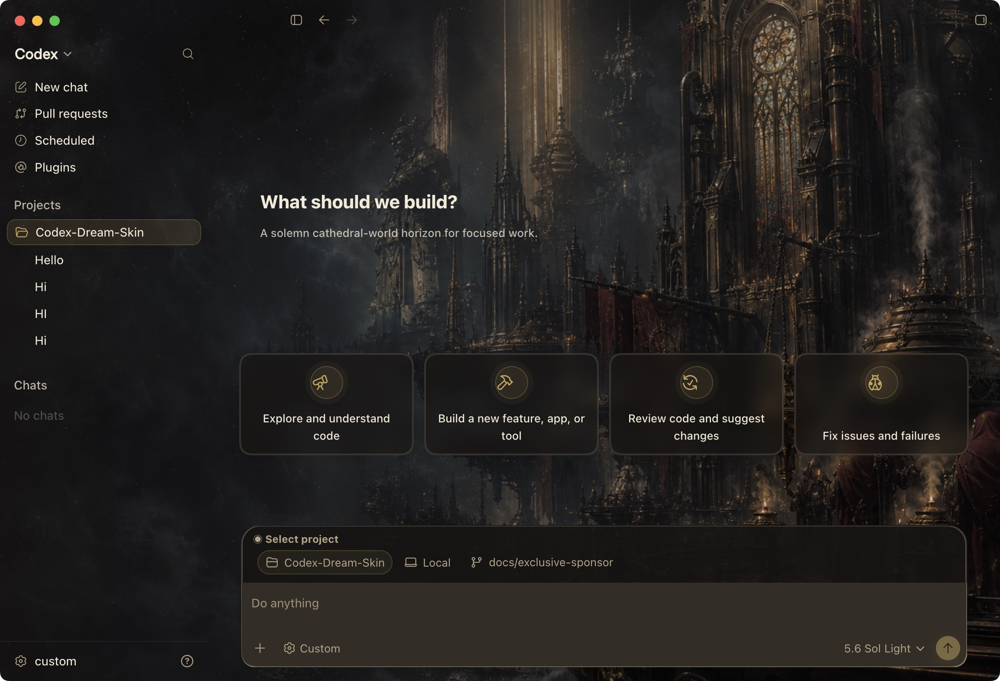

# Codex Dream Skin

Codex Dream Skin 是一个面向官方 Codex Desktop 的外部主题与换肤工具。它通过本机回环 CDP 连接 Codex 的渲染进程，注入受控的 CSS 和装饰 DOM，在不修改官方安装包、`app.asar` 或代码签名的前提下，给 Codex 增加可替换的背景、透明层和主题视觉。

它保留 Codex 原生的侧栏、项目选择、建议卡、任务内容、输入框和菜单交互，不使用整窗截图覆盖，也不改写 API Key、Base URL 或模型供应商配置。

当前代码版本：`1.5.12`。项目同时包含 Windows 和 macOS 实现，并将共享渲染逻辑、主题校验和媒体元数据处理收敛在 `runtime/`。

## 效果展示

当前内置主题 **Gothic Void Crusade** 将背景、玻璃表面、内容可读性和状态装饰融入 Codex 原生界面，同时保留侧栏、项目、任务卡和输入区域的正常交互：



主题不是整窗截图覆盖，而是在官方 Codex 界面上叠加受控的背景与视觉层；你可以继续使用原生控件，也可以在控制中心中实时调整并保存自己的主题。

## 能力概览

- 本机 CDP 注入：启动并验证官方 Codex 渲染页，再注入主题运行时。
- 原生界面保留：装饰层使用 `pointer-events: none`，不遮挡真实控件。
- 自适应背景：根据图片亮度、焦点、左右安全区和宽高比生成可读性层。
- 主题包导入：支持受校验的 `.zip` 主题包和可信的本地简化主题目录。
- 安全 CSS：主题 CSS 经过本地策略校验，只能作用于注册的主题部件。
- 主题管理：支持导入、保存、切换、暂停、重新应用和完整恢复官方外观。
- 可视化控制中心：在本机实时预览背景、玻璃表面和状态特效，保存为新主题后再应用。
- 双平台运行：Windows 托盘与 PowerShell 流程，macOS 原生菜单栏与脚本流程。
- 安装与恢复：提供安装器、运行时复制、进程身份校验、日志和回滚路径。
- 自动化验证：覆盖主题包、渲染注入、选择器、窗口可见性、恢复和发布资产。

## 工作原理

```text
Dream Skin 启动器 / 托盘 / 菜单栏
        |
        | 启动官方 Codex，并将 CDP 限制到 127.0.0.1
        v
官方 Codex Desktop
        |
        | CDP WebSocket：发现 renderer、注入 CSS + JavaScript、验证结果
        v
原生 Codex 控件 + 主题背景 / 透明层 / 装饰效果
```

主题图片和 CSS 在本机读取、校验并注入，不上传到外部 API。启动器会检查目标进程是否属于当前注册的官方 Codex 包，注入器会检查 CDP 端口、浏览器身份和预期 renderer 标记。

## 平台

| 平台 | 入口 | 主要能力 |
|---|---|---|
| Windows | [`windows/README.md`](./windows/README.md) | Store 包发现、PowerShell 安装器、系统托盘、CDP 启动/验证/恢复 |
| macOS | [`macos/README.md`](./macos/README.md) | 原生菜单栏应用、签名运行时校验、DMG、主题编辑和恢复 |
| Shared | [`runtime/`](./runtime/) | 渲染注入、Safe CSS、主题包、图片元数据和跨平台同步源 |

普通用户应优先使用 [GitHub Releases](https://github.com/Fei-Away/Codex-Dream-Skin/releases) 中对应平台的安装包。源码安装和诊断流程请分别阅读平台 README。

## 三类启动入口

项目严格区分三类入口，任何一类的打包或启动调整都不能改写另外两类：

1. **Windows 原生程序**：Release Setup.exe 安装 `CodexDreamSkin.Client.exe`，由客户端内嵌控制中心；安装阶段只部署运行时，应用皮肤和重启 Codex 由客户端操作负责。
2. **macOS 原生程序**：DMG/菜单栏应用使用 `macos/` 下自己的 Swift 与 shell 入口，不调用 Windows 或浏览器控制中心流程。
3. **浏览器测试入口**：仓库根目录的 `control-codex-skin.cmd`（控制中心浏览器测试）与 `start-codex-skin.cmd`（换肤浏览器测试/诊断）只服务开发测试，仍打开外部浏览器，不属于正式产品入口。

浏览器测试入口继续使用源码测试流程；Windows 打包安装流程不得调用浏览器测试入口或其旧的即时应用流程。

Codex Desktop 升级后的选择器取证、共享资产同步、原生审批窗口边界、测试、实机验收和发布流程见 [`docs/codex-upgrade-playbook.md`](./docs/codex-upgrade-playbook.md)。

## 从源码运行

### Windows

浏览器测试/源码流程仍使用原有脚本。在 `windows/` 目录运行前需要关闭 Codex，因为该脚本会立即写入 `config.toml` 并应用基础皮肤；它不被正式 Windows Setup 调用：

```powershell
powershell.exe -NoProfile -ExecutionPolicy RemoteSigned -File .\scripts\install-dream-skin.ps1
```

安装后通过 `Codex Dream Skin` 快捷方式启动，或运行：

```powershell
powershell.exe -NoProfile -ExecutionPolicy RemoteSigned -File .\scripts\start-dream-skin.ps1 -PromptRestart
```

也可以从仓库根目录使用快捷启动入口：

```powershell
powershell.exe -NoProfile -ExecutionPolicy RemoteSigned -File .\start-codex-skin.ps1
```

普通用户无需打开 PowerShell，直接双击仓库根目录的 `start-codex-skin.cmd` 即可启动。启动成功后窗口自动关闭；失败时窗口会保留并暂停，方便查看错误。

正式 Windows 用户使用安装后的 `CodexDreamSkin.Client.exe` 客户端：它在本地托盘中运行隐藏服务，并在内置 WebView2 窗口中承载控制中心。Setup 会把“视频狐妖”视频预设及其 poster、MP4、Safe CSS 和元数据一并安装到已保存主题库，但仍保留图片主题作为默认活动主题。Setup 只携带约 2 MB 的 Microsoft WebView2 Evergreen Bootstrapper，安装时若系统尚未有 WebView2 Runtime 才补装运行时；不会把整套固定版浏览器运行时塞进 Dream Skin 安装包。客户端开发调试可从 `windows/client` 运行。

仓库根目录的 `control-codex-skin.cmd` 仅用于开发测试。它会在 `127.0.0.1` 的随机端口启动本地控制中心并自动打开浏览器，不是正式产品入口。控制中心支持：

- 从当前、内置或已保存主题创建草稿，并实时预览图片/视频背景。
- 调整构图焦点、安全区、任务页强度、视频性能、玻璃透明度/模糊/圆角、背景缩放和压暗。
- 逐项预览 `idle`、`thinking`、`executing`、`approval`、`success`、`error`、`settings`、`overlay` 状态特效。
- 上传最大 10 MiB 的 PNG/JPEG/WebP 或最大 32 MiB 的 MP4/WebM；保存前复用运行时媒体、Safe CSS 和主题校验。
- 每次保存都在 `%LOCALAPPDATA%\CodexDreamSkin\themes\` 创建新的 `custom-*` 主题，不覆盖母版；应用、暂停和继续显示复用现有 Windows 主题操作。
- 为已保存主题填写语义版本、发布者、许可证、来源说明和 AI 素材声明，一键下载 Windows/macOS 通用的正式 `.zip` 分享包。

控制中心只监听回环地址。API 需要随机会话令牌，写操作还要求精确同源 `Origin`；页面不加载第三方脚本、字体或网络资源。完整恢复官方外观仍使用现有恢复入口，不会被伪装成控制中心里的普通外观按钮。

启动并执行一次脱敏 DOM/视觉状态快照：

```powershell
powershell.exe -NoProfile -ExecutionPolicy RemoteSigned -File .\start-codex-skin.ps1 -Capture
```

启动后持续采集首页、会话页、菜单和状态变化：

```powershell
powershell.exe -NoProfile -ExecutionPolicy RemoteSigned -File .\start-codex-skin.ps1 -Watch
```

该入口只调用 `windows/scripts/start-dream-skin.ps1`，不会修改官方 Codex 文件；采集器只记录脱敏 DOM 结构、固定状态枚举和布尔信号，不记录消息文本。

验证当前窗口：

```powershell
powershell.exe -NoProfile -ExecutionPolicy RemoteSigned -File .\scripts\verify-dream-skin.ps1 `
  -ScreenshotPath "$env:TEMP\codex-dream-skin.png"
```

### macOS

macOS 的源码入口、DMG 安装和菜单栏流程见 [`macos/README.md`](./macos/README.md)。源码测试入口为：

```bash
cd macos
./tests/run-tests.sh
```

## Phase 1 Doctor

Doctor 会检查平台运行时文件、版本矩阵、共享契约同步状态和可选的活跃会话。JSON 输出包含稳定的 `schema`、`status`、`checks`、错误码和 `nextAction`：

```powershell
powershell.exe -NoProfile -ExecutionPolicy RemoteSigned -File .\windows\scripts\doctor-dream-skin.ps1 -Json
```

```bash
./macos/scripts/doctor-macos.sh --json
./macos/scripts/doctor-macos.sh --json --require-live
```

共享兼容性矩阵位于 [`runtime/compatibility.json`](./runtime/compatibility.json)，平台副本由 `tools/sync-runtime-assets.mjs` 生成；源码维护者可运行 `node tools/sync-runtime-assets.mjs --check` 验证同步状态。

## 主题包

正式主题包包含：

```text
manifest.json
theme.json
theme.css
background.webp | background.jpg | background.png
background.mp4 | background.webm # 可选；必须配合背景图作为封面
LICENSE.txt                 # 可选
manifest.sig                # 预留字段
```

本地简化主题至少包含非空的 `theme.json`、非空的 `theme.css` 和 `theme.json` 引用的背景图；需要动态背景时可再加入一个 `background.mp4` 或 `background.webm`。导入器会拒绝路径穿越、链接/reparse、嵌套压缩包、未注册文件、超限资源和不符合主题契约的内容。

控制中心只允许导出已保存主题，防止把未保存预览误当成发布版本。导出器会规范化公开字段和固定媒体文件名，生成 `manifest.json` 的逐文件大小与 SHA-256，并分别按 Windows、macOS 和当前客户端版本复验后才返回普通 `.zip`。同一已保存主题不能重复导出同一语义版本；历史记录保存在本机状态目录的 `export-history.json`，分享包本身不长期缓存在控制中心目录。

发布者必须确认图片、视频和衍生素材的授权范围。选择许可证并不会自动获得第三方素材版权；`LICENSE.txt` 只表达发布者对该主题包所作的授权声明。

图片主题应是纯背景，不应把 Codex 窗口、侧栏、输入框、按钮、文字或截图直接烘焙进图片。主题元数据可以控制：

- `appearance`：跟随系统、浅色或深色。
- `art.focusX` / `art.focusY`：图片焦点位置。
- `art.safeArea`：原生内容应避让的安全区。
- `art.taskMode`：任务页使用环境、横幅、全强度或关闭模式。

### 动态视频背景

视频背景是图片主题的可选增强层，图片始终是必需的封面和降级路径：

```json
{
  "image": "background.jpg",
  "video": {
    "src": "background.mp4",
    "performance": "balanced",
    "muted": true,
    "loop": true
  }
}
```

视频只允许使用主题包内固定文件名的 MP4/WebM，大小上限为 32 MiB；视频字节不会编码进注入 payload，只通过受控本地文件 URL 加载。`eco` 只显示封面，`balanced` 使用元数据预加载，`immersive` 允许自动预加载。页面隐藏、窗口失焦、系统偏好减少动态效果、电量过低或播放错误时会自动暂停并回退到封面；视频始终静音、循环且不拦截原生控件交互。

### Codex 状态视觉桥

渲染器会把路由、受限 DOM 语义信号和可选事件桥归一化为 `data-dream-visual-state`：
`unknown`、`home`、`idle`、`thinking`、`executing`、`approval`、`success`、`error`、`settings`、`overlay`。路由状态优先，未识别的任务状态安全回退到 `idle`；状态特效只作用于非交互装饰层，不修改原生控件的交互。

主题可以通过可选的 `stateEffects` 覆盖各状态的内置效果：

```json
{
  "stateEffects": {
    "thinking": {
      "color": "#36d7e8",
      "overlayOpacity": 0.12,
      "motion": "pulse"
    },
    "executing": {
      "mediaOpacity": 0.92,
      "brightness": 1.08,
      "saturation": 1.35,
      "motion": "pulse"
    },
    "success": {
      "color": "#7cff46",
      "overlayOpacity": 0.16,
      "motion": "flash"
    }
  }
}
```

`overlayOpacity` 限制在 `0..0.35`，`mediaOpacity` 限制在 `0..1`，亮度、饱和度、对比度和色相也有固定边界。`motion` 只接受 `none`、`pulse`、`flash`、`alert`，不接受任意 CSS、URL 或脚本。未声明的状态继续使用内置效果；显式使用 `motion: "none"` 可以关闭某一状态的内置动画。边缘状态光对图片和视频主题都有效，且始终保持 `pointer-events: none`。

控制中心使用可选的 `controls` 字段保存通用视觉参数：

```json
{
  "controls": {
    "surfaceOpacity": 0.82,
    "surfaceBlur": 22,
    "surfaceRadius": 18,
    "imageZoom": 1.06,
    "imageDim": 0.24,
    "motionLevel": "standard"
  }
}
```

其中表面透明度限制为 `0.55..1`，模糊限制为 `0..32`，圆角限制为 `8..28`，背景缩放限制为 `1..1.2`，压暗限制为 `0..0.65`，动态级别只接受 `reduced`、`standard`、`expressive`。旧主题省略 `controls` 时继续使用原有渲染效果，不需要迁移。

未来的 Codex 事件适配层可以在页面内发送：

```js
window.dispatchEvent(new CustomEvent("codex-dream-skin:visual-state", {
  detail: { state: "executing" },
}));
```

清除显式状态覆盖使用 `window.__CODEX_DREAM_SKIN_STATE__.clearVisualState()`。非法状态会被拒绝，事件桥不会接受远程 URL、脚本或其他执行指令。

## 安全边界

- 不修改官方 `.app`、`app.asar`、`WindowsApps` 或代码签名。
- CDP 只绑定 `127.0.0.1`，不对局域网开放。
- CDP 本身没有同用户身份认证；主题运行时只应和可信的本机软件一起使用。
- 主题导入、图片处理、Safe CSS 和社区主题下载均采用 fail-closed 校验。
- 安装、启动、切换、暂停、恢复和卸载使用受控状态与进程身份检查。
- 完整恢复会关闭已保存的 CDP 会话，并从官方普通入口重新打开 Codex。
- 图片、视频、字体和人物素材需要单独确认版权、商标和再分发许可。

详细威胁模型和操作边界见 [`SECURITY.md`](./SECURITY.md)。

## 仓库结构

```text
codex-skin/
├── control-center/ 本机可视化主题控制中心与实时预览
├── docs/       项目记录、平台路径、安装和素材说明
├── macos/      macOS 菜单栏、安装、主题和测试
├── runtime/    跨平台共享渲染与主题校验源
├── tools/      选择器、运行时同步和诊断工具
├── windows/    Windows 安装、托盘、CDP 注入、验证和测试
├── AGENTS.md   维护、安全和发布约束
└── SECURITY.md 威胁模型与安全边界
```

修改 `runtime/` 共享源后，应使用现有同步工具生成平台资产，不要只改某一个平台的生成副本。

## 验证

Node 便携回归：

```powershell
node --test macos/tests/*.test.mjs windows/tests/*.test.mjs tools/*.test.mjs
```

Windows 回归：

```powershell
powershell -NoProfile -File windows\tests\run-tests.ps1
```

macOS 回归：

```bash
bash macos/tests/run-tests.sh
```

真实平台验证还需要对应的官方 Codex、系统运行时和图形环境。截图检查、首页/任务页交互和恢复流程以 [`windows/references/qa-inventory.md`](./windows/references/qa-inventory.md) 及 macOS 对应文档为准。

## 分阶段路线

当前仓库已经具备稳定的 CDP 换肤、主题包、安全校验、双平台安装、恢复基础和受控视频背景运行时。后续扩展按以下顺序推进：

1. 固化当前版本的跨平台基线和文档。
2. 完善视频背景在真实 macOS/Windows Codex 环境中的播放验证和性能采样。
3. 将 Codex 页面状态归一化为可驱动视觉的状态事件。
4. 扩展主题协议和主题编辑能力，保持 Safe CSS 和资源校验。
5. 完善版本兼容矩阵、诊断、回滚、安装器和发布验证。

详细计划见 [`task_plan.md`](./task_plan.md)，当前事实和风险见 [`findings.md`](./findings.md)。

## 许可

软件代码使用 MIT，详见 [`LICENSE`](./LICENSE)。第三方运行时、主题图片、赞助素材、人物/IP 素材和其他资产以各自的 NOTICE、LICENSE 或来源说明为准。项目不是 OpenAI 官方产品。
